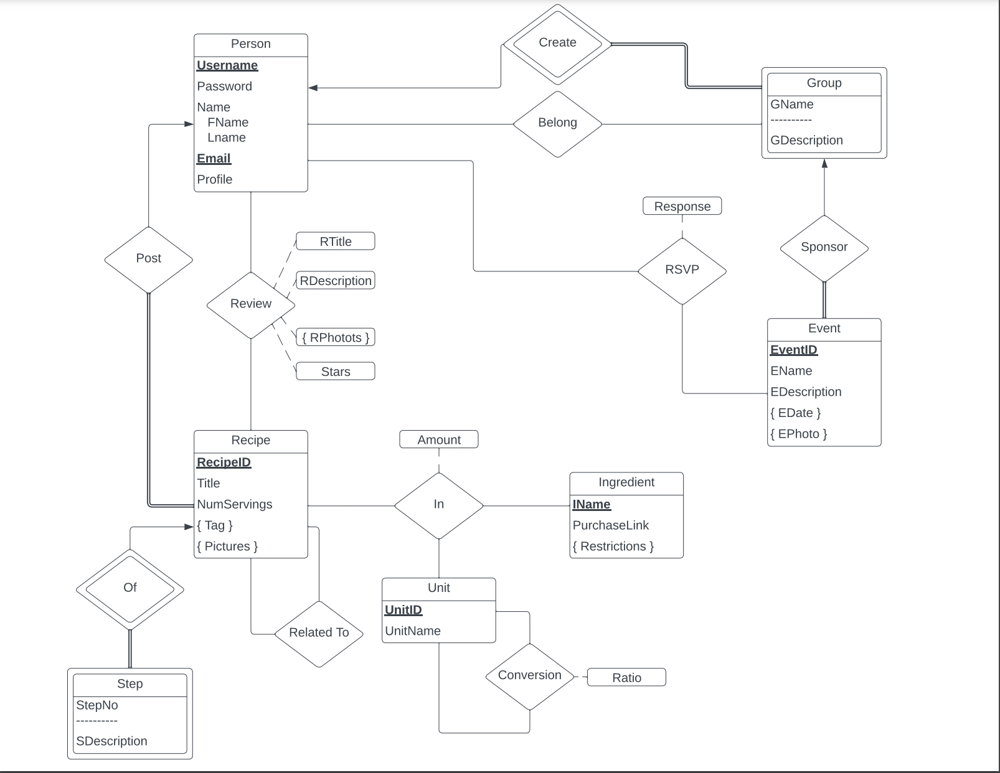

# Cookzilla

**Cookzilla™**, which focuses on cooking and recipes. The site should allow people to post cooking recipes, to review 
and rate posted cooking recipes and to organize cooking meetings with other users.

This website can perform following activities: 
1. Registered users on the site are identified by a unique username, and they can optionally provide a short profile 
with information about themselves. 
2. Users can post recipes on the site that are then visible by everybody. A recipe usually has a title (e.g., “Aunt Mary’s Apple Pie”), 
a number of servings, the ingredients and their quantities, a procedure of how to make the food item, and one or more pictures of the dish. 3. The system will assign a unique recipeID to each recipe. Recipes can also link to other related recipes. The system also has a set
of predefined tags, supplied by the website, to help organize recipes into categories. Examples of such tags would be “Italian’’,
“Chinese”, “vegan”, “soup”, “spicy”, etc. When a user posts a recipe, they can attach one or more of these tags to their recipe. 
4. We will also want to keep track of who posted which recipe. Think a little about how to specify quantities for ingredients, since in recipes, people may use expressions such as ``200 grams of flour”, “one ounce of water”, “one teaspoon of Worcester Sauce”, or
“a pinch of salt”. Note that these units can be converted, e.g., one teaspoon is about 5ml, and you may need to model such conversions.
5. Other users can read the posted recipes, can write reviews of the recipes, and can give a rating (one to five stars). A review has a title, a text for the review, and optionally some photos (since people who used the recipes may want to post pictures of the resulting dish) and some suggestions on how to modify the recipe (e.g., “use butter instead of oil” or “bake at slightly lower temperature for a more moist cake”). We will also want to keep track of who gave which ratings and who wrote which review.
6. Finally, users can create and join informal groups that organize cooking events. Thus, there might be a group called ``Brooklyn Turkish Cooking” whose members occasionally meet to try out recipes for Turkish food. Groups will be identified by the name, along with the username of the person who creates the group. Members can RSVP for such meetings, and may post meeting reports with photos of the event to the site, where they can be read by members of the group but not by other users.

## Available Scripts

In the project directory, you can run:

### `npm start`

Runs the app in the development mode.\
Open [http://localhost:3000](http://localhost:3000) to view it in your browser.

The page will reload when you make changes.\
You may also see any lint errors in the console.

### `npm test`

Launches the test runner in the interactive watch mode.\
See the section about [running tests](https://facebook.github.io/create-react-app/docs/running-tests) for more information.

### `npm run build`

Builds the app for production to the `build` folder.\
It correctly bundles React in production mode and optimizes the build for the best performance.

The build is minified and the filenames include the hashes.\
Your app is ready to be deployed!

See the section about [deployment](https://facebook.github.io/create-react-app/docs/deployment) for more information.

